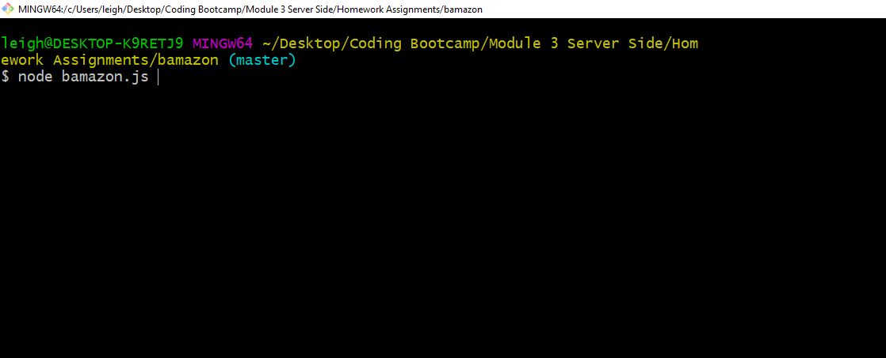
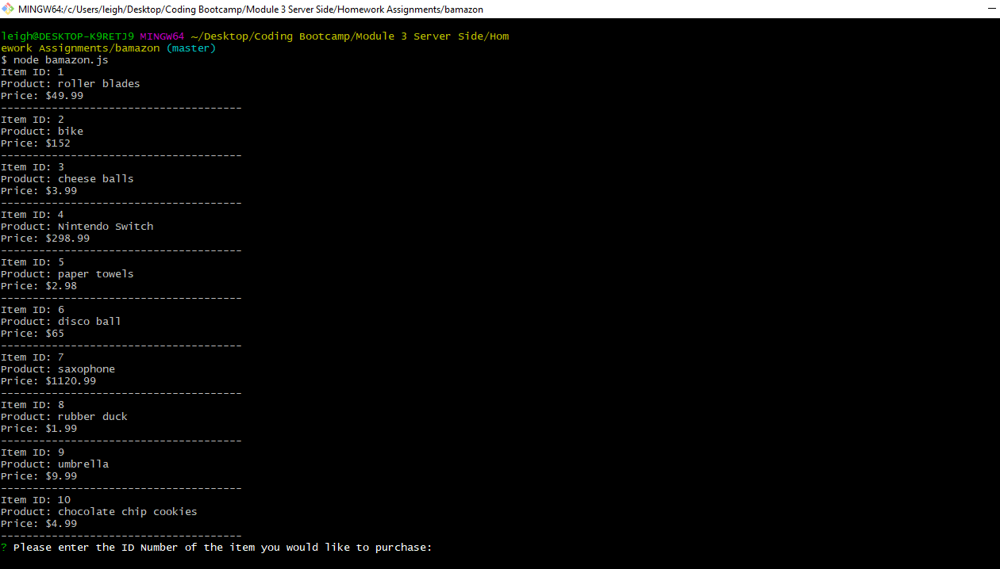
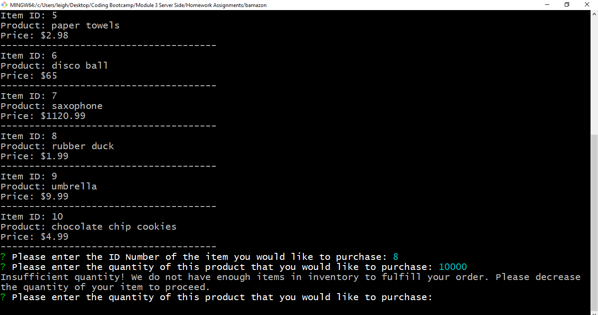
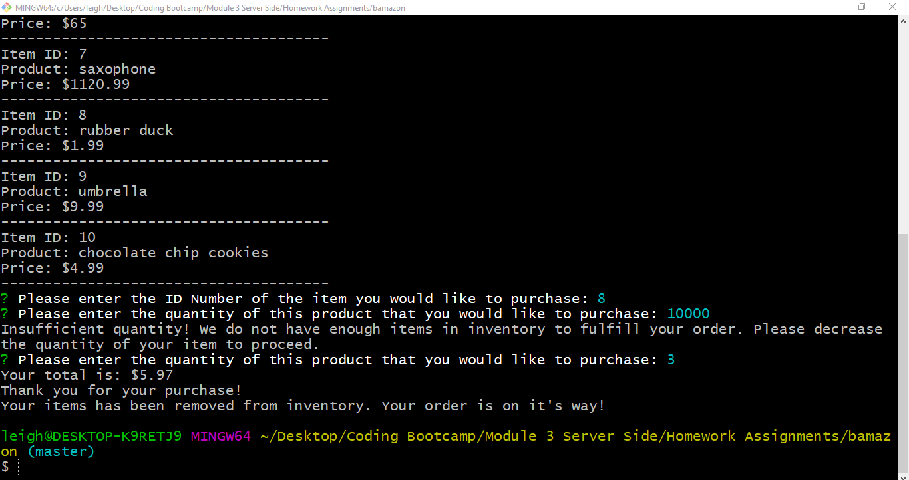

# Bamazon

## Description 

Bamazon is a CLI application built with node.js.  The app presents the user with items available for "purchase". The item id numbers and prices are pulled from a mySQL database. This app utilizes the "inquirer" and "mysql" npm packages.

### User Guide

* The user starts the application by typing "node bamazon.js" into the terminal.

* The application will connect to the mySQL database and display all of the products listed for sale in the database as well as the item's ID number and price. The user will be prompted to enter the ID number of the product they would like to purchase.

* The user will then be prompted to enter how many of the item they would like to purchase. If the user's input exceeds the inventory quantity listed in the database, the app will inform the user and prompt them again to choose a lower quantity.

* If the user enters a number less than or equal to the quanity of that item listed in the database, then the order will be fulfilled. The user will be given the total price for the number of items purchased and the item quanity listed in the database will be updated to display the current number of items that remain in inventory.

### Technologies Utilized

* JavaScript
* MySQL
* Node.js
* NPM Packages
  * MySQL
  * Inquirer
